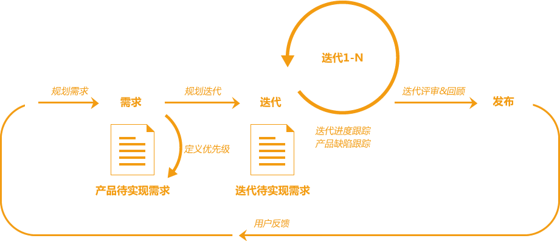

```
转载：https://www.tapd.cn/home/solution/tapdlite
```

轻量敏捷项目管理解决方案包含需求、迭代、故事墙、缺陷、报表、文档等6个核心应用。



作为一个中小型团队，使用TAPD管理整个研发生命周期，使用**需求**承载需求的设计规划，利用**迭代**进行迭代的规划跟踪，通过**缺陷**保证Bug流程可追溯。迭代发布后，及时收集用户反馈进入下一个迭代的研发，实现快速迭代，小步快跑。

## 需求规划

需求的来源不尽相同——用户反馈、已实现功能的优化、新功能模块的增加等，产品经理需将这些不同来源的信息抽丝剥茧，设计成为需求。

> ###### 什么是需求？
>
> 需求 = User Story, 用户故事是从用户的角度来描述用户渴望得到的功能。 用户故事包括三个要素：. 角色：谁要使用这个功能；活动：需要完成什么样的功能；商业价值：为什么需要这个功能，这个功能带来什么样的价值。

在设计需求的过程中，产品经理使用**需求**模块录入需求单，需求单中包含了需求实现的详细描述，往往需求原型图或是其他参考资料也会被作为附件添加到需求单中。

已设计好的需求可通过**需求分类**进行模块化管理。为了保证研发过程中的风险可控，功能比较复杂的需求往往会被拆解成多个需求，以父子需求的方式进行关联。需求父子层级的引入不仅方便需求拆分，同时也保证了子需求的集中管理。

## 迭代规划

项目经理首先创建一个新的**迭代**，并设定迭代的目标、开始和结束时间，然后再往迭代里添加本迭代须实现的需求。

> ###### 什么是迭代？
>
> 迭代是指把一个复杂且开发周期很长的开发任务，分解为很多小周期可完成的任务，这样的一个周期就是一次迭代的过程；同时每一次迭代都可以生产或开发出一个可以交付的软件产品。

迭代需求规划完成后，项目经理组织开发工程师、测试工程师等参与迭代过程的团队成员进行本迭代的需求说明会议。

会议开始后，产品经理向团队成员讲解需求的设计思路，再由团队成员充分讨论需求方案可行性，预估风险。

讨论结束后，团队成员对需求进行工作量评估，由于每个需求都经过了充分的讨论，大家在工作量的评估时很容易就达成了共识。

最后，开发工程师根据自己的兴趣主动认领迭代工作任务，完成迭代工作分配。

## 迭代跟踪

研发过程中使用**故事墙**以及**燃尽图**进行迭代进度跟踪。

> ###### 什么是故事墙？
>
> 故事墙描叙了开发过程中的各个阶段，能反应当前团队开发的健康状态。配合每天的站立会议，开发人员依据故事墙，给大家分享其开发状态、问题、需要的帮助。项目领导者也能够及时的通过故事墙，了解当前团队的状态，并及时调整。

故事墙以卡片的形式，详细地展示了项目的进度。卡片里包含了任务内容、任务优先级、任务负责人、当前状态等信息。

在进行每日晨会时，结合白板故事墙或是电子版故事墙，团队成员都可以通过故事墙清晰地了解每个成员工作状况和当前迭代进度。

迭代进度还可以通过**燃尽图**得以体现。

> ###### 什么是燃尽图？
>
> 燃尽图能形象地展示当前迭代中的剩余工作量和剩余工作时间的变化趋势，是反应项目进展的一个指示器。一般在每日站会后团队会根据任务的完成情况对其进行更新。

燃尽图相比故事墙，为迭代进度提供了量化的数据展示。燃尽图的走向代表了迭代进度的健康度，当出现异常时，需要对团队开发节奏进行调整。

## 缺陷管理

研发过程中，测试工程师使用**缺陷**进行缺陷管理。开发工程师完成需求开发后，测试工程师跟进测试。

测试工程师首先根据需求罗列出测试重点，然后根据测试重点进行测试。测试过程中发现了Bug，便会填写缺陷单，并分配给需求开发人。

缺陷单包含了Bug的重现规则、关联需求、优先级和紧急程度等信息。

开发工程师修复Bug后，将缺陷单状态设置为已解决，此时缺陷单流转回测试工程师手中。测试工程师验证Bug已正确修复后，将缺陷单关闭，否则打回给开发工程师。整个过程可重复进行，直至Bug被正确修复。

## 统计分析

统计模块除了提供缺陷统计、需求分布统计、进度跟踪、工时花费报告、需求关联统计等丰富的内置报表外，同时也支持通过报表自定义，灵活定制团队专属统计报表。

项目经理可以将统计报表作为邮件内容，创建定时报告发送给团队成员，方便所有团队成员关注开发质量。

## 知识沉淀

团队在研发过程中产生的经验积累可以通过**文档**承载，无论是团队发展过程的记录，还是产品里程碑规划，或者是开发测试工程师的技术分享，都可以在文档中呈现。

每个团队成员都可以通过文档收集并整理知识条目，对知识库进行补充和反馈，实现团队经验的积累与传承。

TAPD**轻量敏捷项目管理**解决方案的设计紧密地融合了敏捷研发思想，覆盖了整个研发生命周期，能有效提升团队研发效率，快速迭代，持续产出，保证产品的持续可用。对中小型研发团队而言，它不仅是一套项目管理工具，更是敏捷研发的最佳实践